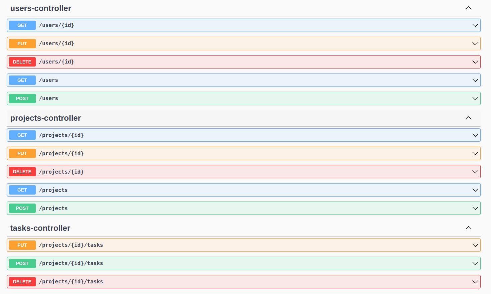

# PAP22-Z16

### Lista członków zespołu:
<ul>
    <li>Marcin Jarczewski</li>
    <li>Franciszek Malewski</li>
    <li>Jakub Jóźwiak</li>
    <li>Michał Ładyżyński</li>
</ul>

### Treść zadania:
W ramach projektu z przedmiotu Programowanie Aplikacyjne planujemy stworzyć aplikację umożliwiającą bugtracking i zarządzanie projektami, podobną do programu Jira. Chcemy, aby program zawierał następujące funkcjonalności:
<ol>
    <li>Możliwość tworzenia kont użytkownika</li>
    <li>System logowania</li>
    <li>Możliwość pracy na wspólnym projekcie</li>
    <li>Możliwość dodawania nowych zadań i przypisywania do nich osób, terminów wykonania</li>
    <li>Monitorowanie postępu nad zadaniami / projektami</li>
    <li>Inne, jeszcze nie wyznaczone</li>
</ol>

### Opis rozwiązania:
Wybrana technologia: Java Spring
Dostępna po uruchomieniu programu [dokumentacja API]

### Aktualny poziom zaawansowania rozwiazania:
W celu uruchomienia programu, konieczna jest jego kompilacja. Najpierw przy użyciu Gradle, a następnie za pomocą SpringBoot.
Następnie otworzenie programu jest możliwe po otworzeniu następującego adresu w przeglądarce: [dokumentacja API]

Na ten moment zostały zaimplementowane funkcje, które w niedalekiej przyszłości posłużą do stworzenia funkcjonującej aplikacji.
Projekt został również zintegrowany ze Swagger UI, który za sprawą naszych wysiłków umożliwia przetestowanie zaimplementowanych funkcji.
Aktualna aplikacja prezentuje się następująco:




## Konteneryzacja
Przed uruchomieniem aplikacji należy stworzyć plik `.env` w którym należy podmienić wartości zmiennych.
```
DB_USER=<user>
DB_PASSWORD=<passwd>
```
Aby uruchomić aplikację należy wykorzystać `docker compose`. Uruchomiona aplikacja będzie działała pod portem `5000` [aplikacja]
a dostęp do api będzie możliwy pod portem `8080`
```bash
docker compose up
```
Do przebudowania od nowa potrzeba flag `--force-recreate` oraz `--build`

Aby ją zatrzymać należy użyć polecenia
```bash
docker compose down --remove-orphans
```

[//]: # (```bash)

[//]: # (docker run -d --name almost-jira-mongo -p 27017:27017 -e MONGO_INITDB_ROOT_USERNAME=root -e MONGO_INITDB_ROOT_PASSWORD=okon mongo)

[//]: # (```)

## Baza danych
Aplikacja wykorzystuje bazę danych mongodb, która jest hostowana a zewnetrznym serwisie `MongoDBCloud`

### TODO
- [ ] dodać walidacje danych
- [ ] usunąć pole hasło przy zwracaniu wyników
- [x] dodać zapisywanie hasło i projekty do bazy

[//]: # (/home/percival/.jdks/temurin-17.0.5/bin/java  -jar /home/percival/src/pap22z-z16/almost-jira/build/libs/almost-jira-0.0.1-SNAPSHOT-plain.jar)

[//]: # (link)
[dokumentacja API]: http://localhost:8080/swagger-ui/index.html
[aplikacja]: http://localhost:5000
